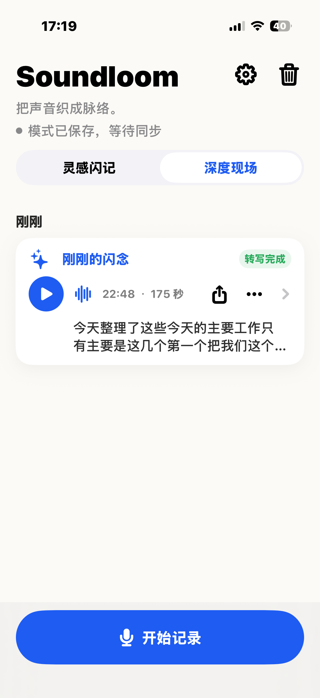
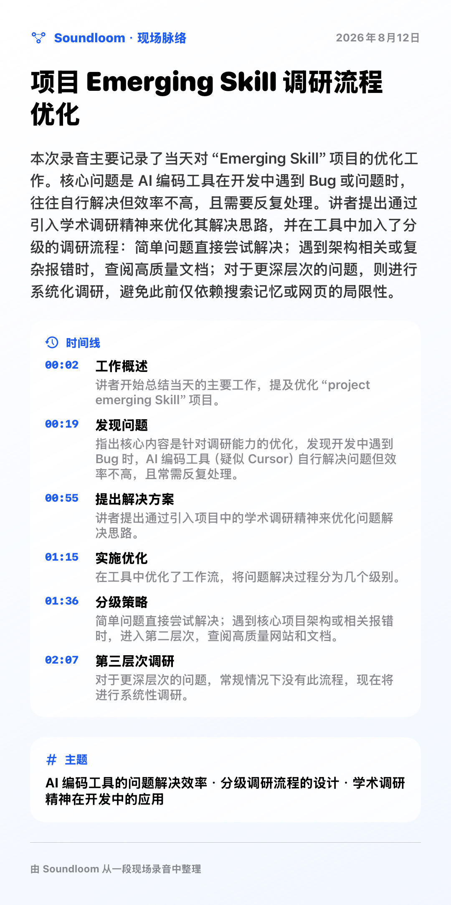

# Soundloom

[简体中文](README.zh-CN.md)

> *Weave voice into clarity.* 
> 把声音织成脉络。

Recording is easy. Finding the useful part later is not. Soundloom is an iPhone app that keeps the original audio and brings the transcript, people, events, and topics back into the same context.

It works for a ten-second thought as well as an interview, meeting, or longer field recording.

> [!IMPORTANT]
> Soundloom is still in development. This first public repository contains the iPhone SwiftUI source, not a standalone iOS Xcode project or an App Store release.

## Screens

<table>
  <tr>
    <td align="center"></td>
    <td align="center"></td>
  </tr>
  <tr>
    <td align="center"><strong>Recording inbox</strong></td>
    <td align="center"><strong>Deep Field outline</strong></td>
  </tr>
</table>

## Two ways to record

| Mode | Best for | What you get |
| --- | --- | --- |
| **Inspiration Quick Capture** | Ideas, observations, reminders, and questions | Original audio, transcript, and a concise inspiration record |
| **Deep Field** | Interviews, meetings, field observations, and long recordings | Original audio, transcript, and an optional overview, timeline, topics, participants, and action items |

Both modes use the same local inbox. They differ in how a recording is organized, not in whether the source is kept.

## From voice to context

1. **Record or import.** Capture audio in the iPhone app, or import it from a supported system entry point.
2. **Save the source first.** Soundloom writes the recording to the local inbox before transcription or organization starts. A later failure does not discard the original material.
3. **Choose how to transcribe.** Apple Speech is the current path and works directly with iPhone permissions and system services. The project also leaves room for cloud speech providers that may better suit other languages, long recordings, or speaker separation; that provider layer is not finished yet.
4. **Organize when needed.** Soundloom sends the required transcript text to a configured AI service only after the user asks. A short recording can become an inspiration note; a long one can become an overview, timeline, and set of topics.
5. **Return to the context.** Audio, transcript, and organized result stay together. You can read the result and still return to the recording behind it.

The original audio remains available throughout. Transcription and organization are added as separate layers rather than replacing the source.

## What is here today

- an iPhone SwiftUI interface with Inspiration Quick Capture and Deep Field modes;
- in-app recording and a local recording inbox;
- audio import for iOS Shortcut or Action Button workflows;
- Apple Speech transcription;
- optional organization into inspiration notes and field outlines;
- BYOK provider settings, with API keys stored in Keychain;
- recoverable states for saved, transcribing, waiting, completed, and failed work.

Some AI services work through an OpenAI-compatible adapter. Others currently have configuration models only. Check the implemented adapters in the source before relying on a provider.

## Boundaries

- No ambient or always-on recording. Each recording starts with an explicit action.
- Transcripts and organized results do not replace the original audio.
- AI organization does not run automatically and is not required for recording.
- Recordings stay local by default. When external processing is requested, the app should make clear what leaves the device.

## Apple Watch and Mac

Soundloom has exploratory Apple Watch and Mac versions. Their code is not part of this first public repository.

- **Apple Watch** is designed for intentional, low-friction capture: one main recording action, a clear recording state, and no ambient listening.
- **Mac** is conceived as a larger listening desk for reviewing long recordings, comparing audio with transcripts, and organizing Deep Field material.

## Where data goes

| Data | Default handling |
| --- | --- |
| Original audio, transcripts, and organized results | Stored in the iPhone app container |
| Audio used by Apple Speech | May be processed by Apple's speech-recognition service; offline processing is not guaranteed |
| Text used for AI organization | Sent to the selected provider only after the user requests it |
| Provider API keys | Stored in Apple Keychain |

See the [Privacy Policy](PRIVACY.md) and [Data Flow](docs/DATA_FLOW.md) for details. Before any release, the app's behavior, privacy policy, and App Store disclosures must agree.

## Repository contents

| Path | Contents |
| --- | --- |
| `src/` | iPhone Swift and SwiftUI source |
| `assets/screenshots/` | Product screenshots used in this README |
| `appstore/` | Draft App Store metadata and review notes |
| `docs/` | Data flow, integration notes, and release preparation |

## Trying the source on iPhone

The repository does not yet include a standalone `.xcodeproj` or `.xcworkspace`. To run the current source:

1. Create an iOS SwiftUI App target in Xcode with iOS 16 or later as the deployment target.
2. Add the public files under `src/` to the target.
3. Present `SoundloomAppRootView()` from the app scene.
4. Add microphone and speech-recognition usage descriptions.
5. Configure App Intents, background audio, and Keychain capabilities for the paths you want to test.
6. Check recording, permissions, interruption recovery, local storage, and transcription on a physical iPhone.

This repository is ready to read and experiment with, but it is not yet an installable release project. Release requirements are tracked in the [Public Release Checklist](docs/PUBLIC_RELEASE_CHECKLIST.md).

## Contributing

- [Contributing Guide](CONTRIBUTING.md)
- [Support](SUPPORT.md)
- [Security Policy](SECURITY.md)
- [Code of Conduct](CODE_OF_CONDUCT.md)
- [Release Process](docs/RELEASE_PROCESS.md)
- [Changelog](CHANGELOG.md)

Do not commit real recordings, transcripts, API keys, certificates, provisioning profiles, or screenshots containing private information.

## Contact

For general support, privacy questions, or private security reports, email [krystalwy10@gmail.com](mailto:krystalwy10@gmail.com). Do not attach real recordings, transcripts, or credentials directly to the message.

## License

Source code is available under the [Apache License 2.0](LICENSE). The Soundloom name, logo, and product assets are not included in that grant; see the [Brand Policy](TRADEMARKS.md) and [Third-Party Notices](THIRD_PARTY_NOTICES.md).
