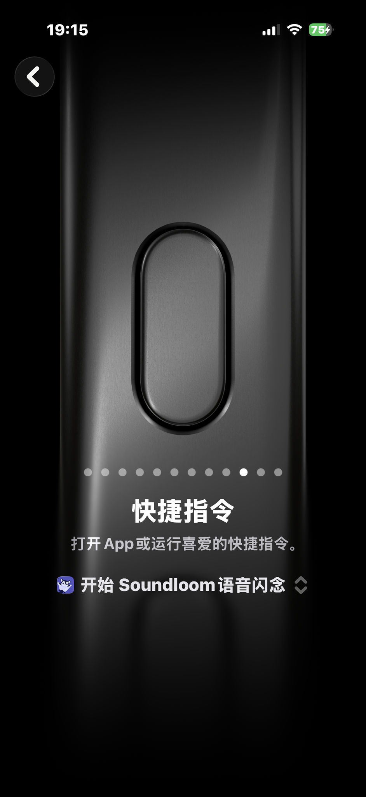

  

<h1 align="center">Soundloom</h1>

<a href="README.md">English</a>

<em>Weave voice into clarity.</em> 把声音织成脉络。

录音很容易，之后找回真正重要的内容却很难。Soundloom 是一个 iPhone 录音整理工具：它先保留原始声音，再把转写、人物、事件和主题放回同一条脉络里。

你可以用它记下十秒钟的灵感，也可以整理一场访谈、会议或持续发生的现场。

> [!IMPORTANT]
> Soundloom 仍在开发中。仓库首次公开的内容是 iPhone SwiftUI 源码，不含独立的 iOS Xcode 工程，也不是已经上架 App Store 的发行版。

## 界面

<table>
  <tr>
    <td align="center"></td>
    <td align="center"></td>
    <td align="center"></td>
  </tr>
  <tr>
    <td align="center"><strong>录音收件箱</strong></td>
    <td align="center"><strong>深度现场提纲</strong></td>
    <td align="center"><strong>操作按钮快捷指令</strong></td>
  </tr>
</table>

## 两种记录方式

| 模式 | 适合记录 | 得到什么 |
| --- | --- | --- |
| **灵感闪记** | 想法、观察、提醒和问题 | 原始录音、转写与一条简洁的灵感记录 |
| **深度现场** | 访谈、会议、田野观察和长录音 | 原始录音、转写，以及可选的概览、时间线、主题、参与者和待办 |

两种模式进入同一个本地收件箱。区别只在整理方式，不在材料是否被保留。

## 从声音到脉络

1. **录制或导入。** 在 iPhone 中直接录音，也可以从受支持的系统入口导入音频。
2. **先保存原音。** Soundloom 会先把录音写入本地收件箱，再开始转写或整理。后续处理失败，也不会丢掉原始材料。
3. **选择转写方式。** 当前使用 Apple Speech，与 iPhone 的权限和系统能力直接衔接。项目也为云端语音服务保留了接口，以便以后支持更多语言、长录音或说话人区分；这部分尚未完成。
4. **需要时再整理。** 只有用户主动发起，Soundloom 才会把必要的转写文本发送给已配置的 AI 服务。短录音可以整理成灵感记录，长录音可以形成概览、时间线和主题。
5. **回到上下文。** 原始声音、转写和整理结果放在一起查看。你看到的不只是一份摘要，也能随时回到它所依据的录音。

原始录音会一直保留。转写和整理只是叠加在上面的两层信息，不会替代前面的材料。

## 当前已有

- iPhone SwiftUI 界面，包含“灵感闪记”和“深度现场”；
- 应用内录音和本地录音收件箱；
- 面向 iOS 快捷指令或操作按钮工作流的音频导入；
- Apple Speech 转写；
- 可选的灵感记录与现场提纲整理；
- BYOK 服务配置，API Key 保存在 Keychain；
- 可恢复的处理状态，包括已保存、转写中、等待整理、已完成和失败。

部分 AI 服务已经可以通过 OpenAI 兼容接口调用，另一些目前只有配置模型。使用前请以源码中的适配器实现为准。

## 几条边界

- 不做环境监听或常驻录音，每次录音都需要明确操作。
- 原始录音不会被转写或整理结果覆盖。
- AI 整理不会自动运行，也不是完成录音的前提。
- 录音默认留在本地；需要外部处理时，应先让用户知道哪些数据会离开设备。

## Apple Watch 与 Mac

Soundloom 已有 Apple Watch 和 Mac 的探索性版本，本次暂不公开它们的代码。

- **Apple Watch** 侧重贴身、快速而明确的采集：一个主要录音动作，配合清楚的录音状态，不做环境监听。
- **Mac** 更像一张“聆听台”：用更大的空间回看长录音，对照原音与转写，并整理深度现场材料。

## 数据去向

| 数据 | 默认处理方式 |
| --- | --- |
| 原始录音、转写和整理结果 | 保存在 iPhone 应用的本地容器 |
| Apple Speech 转写所需音频 | 可能由 Apple 的语音识别服务处理，不保证完全离线 |
| AI 整理所需文本 | 仅在用户主动请求后发送给所选服务商 |
| 服务商 API Key | 保存在 Apple Keychain |

完整说明见[隐私政策](PRIVACY.zh-CN.md)和[数据流](docs/DATA_FLOW.md)。正式发布前，App 的实际行为、隐私政策和 App Store 披露必须保持一致。

## 仓库内容

| 路径 | 内容 |
| --- | --- |
| `src/` | iPhone Swift 与 SwiftUI 源码 |
| `assets/screenshots/` | README 使用的产品截图 |
| `appstore/` | App Store 元数据和审核说明草案 |
| `docs/` | 数据流、集成说明和发布准备材料 |

## 在 iPhone 工程中查看

仓库暂时没有独立的 `.xcodeproj` 或 `.xcworkspace`。要运行当前源码：

1. 在 Xcode 中创建部署目标为 iOS 16 或更高版本的 SwiftUI App target。
2. 把 `src/` 中的公开文件加入 target。
3. 在 App scene 中展示 `SoundloomAppRootView()`。
4. 添加麦克风和语音识别用途说明。
5. 按测试范围配置 App Intents、后台音频和 Keychain 能力。
6. 在真实 iPhone 上检查录音、权限、中断恢复、本地存储和转写。

当前仓库适合阅读和试验，还不是可直接安装的发布工程。发布条件记录在[公开发布检查清单](docs/PUBLIC_RELEASE_CHECKLIST.md)中。

## 参与项目

- [贡献指南](CONTRIBUTING.md)
- [支持](SUPPORT.md)
- [安全政策](SECURITY.md)
- [行为准则](CODE_OF_CONDUCT.md)
- [发布流程](docs/RELEASE_PROCESS.md)
- [更新日志](CHANGELOG.md)

请勿提交真实录音、转写、API Key、证书、Provisioning Profile，或包含私人信息的截图。

## 联系方式

一般支持、隐私问题或需要私下报告的安全问题，请发送邮件至krystalwy10@gmail.com [krystalwy10@gmail.com](mailto:krystalwy10@gmail.com)。请勿在邮件中直接附上真实录音、转写或凭据。

## 许可证

源代码使用 [Apache License 2.0](LICENSE)。Soundloom 名称、标志和产品素材不包含在该授权中，详见[品牌政策](TRADEMARKS.md)与[第三方声明](THIRD_PARTY_NOTICES.md)。
